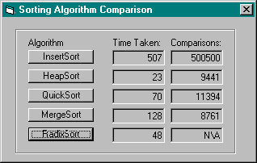



## Easy to use Sorting Algorithms

### Description

I had to write some sorting algorithms in Java for an algorithms assignment I had. I got a good mark for the assignment (95%) and didn't want to just trash the algorithms, so I re-wrote in VB encapsulated in easy to use class modules. Included is insertsort, quicksort, mergesort, heapsort and radixsort
 
### More Info
 

             |
---                |---
**Submitted On**   |2002-07-08 03:25:46
**By**             |[JimCamel](https://github.com/Planet-Source-Code/PSCIndex/blob/master/ByAuthor/jimcamel.md)
**Level**          |Intermediate
**User Rating**    |4.5 (45 globes from 10 users)
**Compatibility**  |VB 4\.0 \(32\-bit\), VB 5\.0, VB 6\.0
**Category**       |[Math/ Dates](https://github.com/Planet-Source-Code/PSCIndex/blob/master/ByCategory/math-dates__1-37.md)
**World**          |[Visual Basic](https://github.com/Planet-Source-Code/PSCIndex/blob/master/ByWorld/visual-basic.md)
**Archive File**   |[Easy\_to\_us103133772002\.zip](https://github.com/Planet-Source-Code/jimcamel-easy-to-use-sorting-algorithms__1-36683/archive/master.zip)

